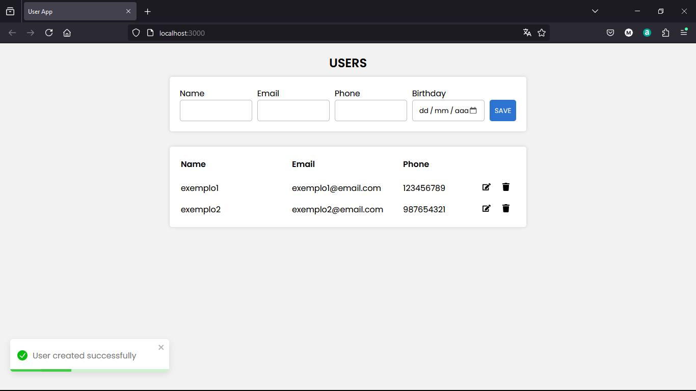

# Registro de Usuários



> O App foi desenvolvido com o objetivo de exercitar o conhecimento sobre um projeto fullstack com banco de dados.<br/>
> Apesar de ter uma funcionalidade simples, o mesmo é utilizado em diversas aplicações.<br/>
> O projeto consiste em um CRUD de usuários no qual contém <b>nome, email, fone</b> e <b>data de nascimento</b>.


## 🚀 Instalando Crud-fullstack

Para instalar o Crud-fullstack, siga estas etapas:

1. Clone o repositório.
   ```
   git clone https://github.com/Matheus-T-C-Mourao/Crud-fullstack.git
   ```


2. Navegue até o diretório do projeto

    ```
    cd Crud-fullstack
    ```
    
3. Instalar dependências

   ```
   npm install
   ```

4. Para iniciar a aplicação, rode o comando:

   ```
   npm start
   ```


## 📫 Contribuindo para Crud-fullstack

Para contribuir com <Crud-fullstack>, siga estas etapas:

1. Bifurque este repositório.
2. Crie um branch: `git checkout -b <nome_branch>`.
3. Faça suas alterações e confirme-as: `git commit -m '<mensagem_commit>'`
4. Envie para o branch original: `git push origin <nome_do_projeto> / <local>`
5. Crie a solicitação de pull.

Como alternativa, consulte a documentação do GitHub em [como criar uma solicitação pull](https://help.github.com/en/github/collaborating-with-issues-and-pull-requests/creating-a-pull-request).

## 📝 Licença

Esse projeto está sob licença. Veja o arquivo [LICENÇA](LICENSE.md) para mais detalhes.
